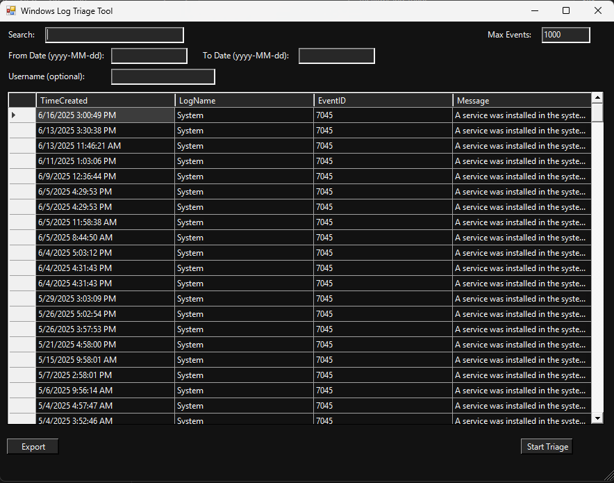

# 🛡️ Windows Log Triage Tool (GUI)

A lightweight, PowerShell-based GUI application designed for quick triage of Windows Event Logs — useful for Blue Teamers, IR analysts, SOCs, and IT admins.

 <!-- Optional: Add a screenshot here -->

## 🔍 Features

- 🚀 Simple GUI built with WinForms (no extra dependencies)
- 📅 Filter by date range (`From` and `To` fields)
- 👤 Filter by specific usernames
- 🔎 Live keyword search within results
- 📁 Export filtered results to CSV
- 🎨 Dark theme for better readability
- 📐 Dynamic window resizing support

## 📦 Requirements

- Windows PowerShell 5.1+
- .NET Framework (comes with Windows)
- Run **as Administrator** for full event log access
- Sysmon installed and logging enabled (for Sysmon events)

## 🧰 Event Logs Queried

This tool pulls potentially suspicious events from:

| Source                          | Event IDs                          |
|-------------------------------|------------------------------------|
| Security                      | 4624, 4625, 4672, 4720, 4698       |
| Windows PowerShell            | 4104                               |
| System                        | 7045                               |
| Sysmon (if installed)         | 1, 3, 11, 13, 15, 22, 23, 24, 25    |

## ⚙️ How to Use

1. **Download the script**  
   Clone or download this repository.

2. **Run the script as Administrator**
   ```powershell
   powershell -ExecutionPolicy Bypass -File .\LogTriageGui.ps1
   ```

 ## 3.  Use the GUI

- Search for suspicious activity

- Use filters (date, username, keywords)

- Export results as needed

📤 Export Example

All filtered events can be exported to a .csv file via the Export button for later review or reporting.
📸 Screenshot


💡 Tip

To get better results:

  - Ensure Sysmon is installed and configured.

  - Use broad date ranges and narrow down via search.

👨‍💻 Author

@mell0wx
Passionate about threat detection, purple teaming, and cybersecurity automation.
📜 License

This project is released under the MIT License.
